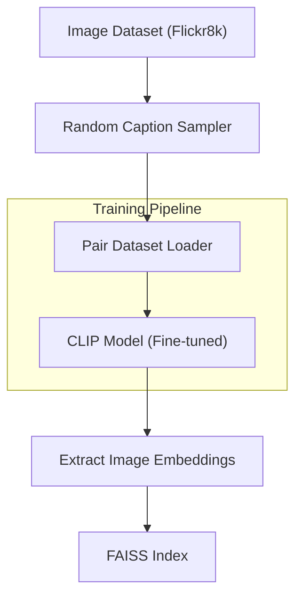
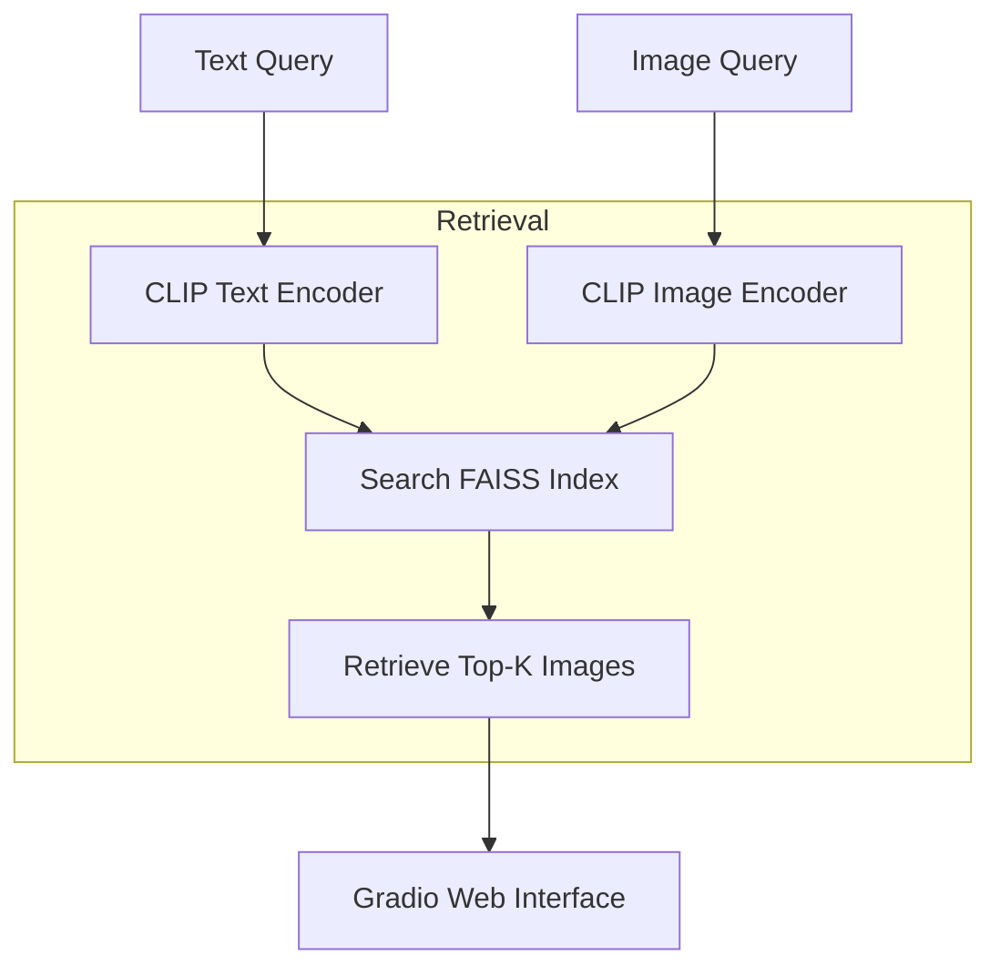

# 📸 ContextVision: A Context-Aware Multimodal Image Search Engine

> **ContextVision** is a multimodal image search engine that uses a fine-tuned CLIP model to perform semantic, context-aware search using either text or image input — with lightning-fast results powered by FAISS.

<video src="https://github.com/user-attachments/assets/d53088d9-783d-4eb5-bb58-b99887e459d2" controls width="600"></video>

## Problem Statement

Traditional image search systems struggle with:
- Keyword-only matching fails to capture image semantics (high semantic mismatch rate)
- Poor compositional understanding (e.g., "green car" may return green logos)
- Missing context sensitivity (e.g., "people in kitchen" returns food images)
- Single-modality limitation (can't easily search using example images)
- Slow retrieval on large image collections without proper indexing

## Approach

**Dual-Modality Architecture** combining:

1. **CLIP Embedding Generation**
   - Uses OpenAI's CLIP model (ViT-B/32)
   - Projects both images and text into a shared 512-dimensional vector space
   - Enables semantic understanding of both visual content and natural language

2. **FAISS Vector Search**
   - Employs Facebook AI Similarity Search (FAISS) for efficient nearest-neighbor retrieval
   - Uses cosine similarity between query and image vectors
   - Enables sub-second retrieval even on large datasets

3. **Gradio Web Interface**
   - User-friendly search and results gallery
   - Supports both text and image queries
  
## Architecture

### 1. Training Pipeline 

### 2. Retrieval Pipeline 

## Pipeline

**1. Training and Indexing Workflow:**

1. **Image Dataset (Flickr8k):**  
   Collection of 8,000 natural images, each with five human-annotated captions.

2. **Random Caption Sampler:**  
   For each image, one caption is randomly selected per training epoch (implemented in the dataset loader).

3. **Pair Dataset Loader:**  
   Loads (image, caption) pairs for each batch during training.

4. **CLIP Model (Fine-tuned):**  
   Model is fine-tuned on these pairs using a contrastive loss that aligns image and text embeddings.

5. **Extract Image Embeddings:**  
   After training, embeddings are generated for all images in the dataset.

6. **FAISS Index:**  
   The image embeddings are indexed using FAISS for fast similarity search.

**2. Retrieval Workflow**

1. **Query Input:**  
   The user submits either a text query (natural language) or an image query (example image) via the Gradio web interface.

2. **Query Embedding:**  
   The query (text or image) is encoded using the fine-tuned CLIP model to produce a 512-dimensional embedding.

3. **Similarity Search:**  
   The query embedding is compared against all indexed image embeddings using FAISS (cosine similarity) to find the most similar images.

4. **Results Display:**  
   The top-k most similar images are displayed to the user in a gallery format.

## CLIP Fine-Tuning with Contrastive Image-Text Loss

Model is fine-tuned on image-text pairs using a contrastive loss that aligns image and text embeddings.

The CLIP contrastive loss is defined as follows:

$$
\mathcal{L} = \frac{1}{2} \left[
  -\frac{1}{N} \sum_{i=1}^N \log \frac{\exp(s_{i,i})}{\sum_{j=1}^N \exp(s_{i,j})}
  -\frac{1}{N} \sum_{i=1}^N \log \frac{\exp(s_{i,i})}{\sum_{j=1}^N \exp(s_{j,i})}
\right]
$$

where

- $I$ = image embeddings, $T$ = text embeddings, $\tau$ = temperature parameter
- $\hat{I}_i = \frac{I_i}{\|I_i\|}$ and $\hat{T}_j = \frac{T_j}{\|T_j\|}$ are normalized image and text embeddings
- $s_{i,j} = \frac{\hat{I}_i \cdot \hat{T}_j}{\tau}$ is the similarity (logits) between image $i$ and text $j$
- The loss encourages the similarity between matched image-text pairs to be higher than mismatched pairs
- The temperature parameter $\tau$ controls the sharpness of the softmax

### Why Fine-Tune CLIP?

While the base CLIP model performed reasonably well, it often failed on compositional or context-sensitive queries. For instance, queries like *“child in red shirt outdoors”* often returned generic outdoor images, lacking specific visual elements described in the caption. Fine-tuning on Flickr8k captions helped sharpen the alignment between fine-grained image semantics and natural descriptions — improving retrieval precision on context-heavy queries.

## Key Components

| Component         | Technology        | Key Parameters                  |
|-------------------|------------------|---------------------------------|
| Embedding Model   | CLIP ViT-B/32    | 512D vectors, cosine similarity |
| Vector Database   | FAISS            | IndexFlatIP, 8K vectors         |
| User Interface    | Gradio           | Multi-tab, gallery output       |
| Image Processing  | Pillow/Torchvision| 224x224px, center crop         |
| Deployment        | HuggingFace Spaces| Gradio SDK 4.13.0              |

## Datasets

| Dataset        | Size                   | Type            | Purpose             |
|----------------|------------------------|-----------------|---------------------|
| Flickr8k       | 8,000 images, 5 captions each | Natural images  | Primary dataset     |

## Results (Flickr8k)

| Metric      | Value  | Max Possible | % of Max |
|-------------|--------|--------------|----------|
| Precision@5 | 0.176  | 0.20         | 88%      |
| Recall@5    | 0.880  | 1.00         | 88%      |
| MRR         | 0.751  | 1.00         | 75%      |
| nDCG@5      | 0.783  | 1.00         | 78%      |

> *Metrics are based on 100 text and image queries using Flickr8k, with exact-match ground truth.*

## Features

- **Text-to-Image Search:** Retrieve images by natural language description.
- **Image-to-Image Search:** Upload an image to find visually similar ones.
- **Semantic Understanding:** Captures meaning beyond simple visual similarity.
- **Fast Retrieval:** Sub-second response times even on large collections.
- **User-Friendly Interface:** Simple design with gallery-style results.

---
