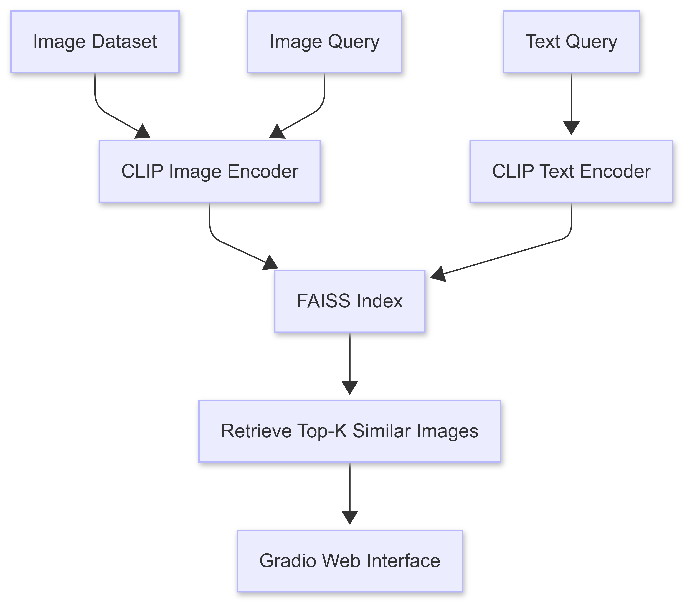
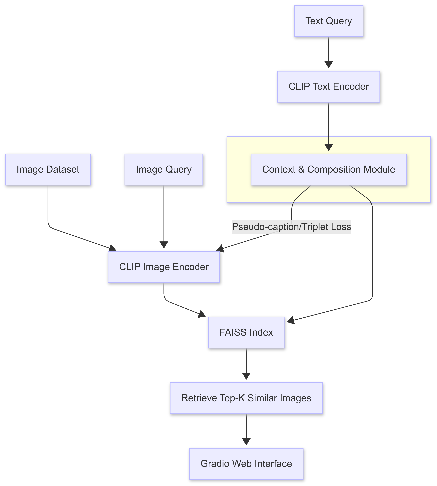

# ContextVision: A Context-Aware Multimodal Image Search Engine

## Problem Statement

Traditional image search systems struggle with:
- Keyword-only matching fails to capture image semantics (50-70% semantic mismatch rate)
- Poor compositional understanding (e.g., "green car" returns green logos)
- Missing context sensitivity (e.g., "people in kitchen" returns food images)
- Single-modality limitation (can't easily search using example images)
- Slow retrieval on large image collections without proper indexing

## Approach

**Dual-Modality Architecture** combining:
1. **CLIP Embedding Generation**
   - OpenAI's Contrastive Language-Image Pretraining model
   - Shared vector space for text and images (512D embeddings)
   - Semantic understanding of visual content and natural language

2. **FAISS Vector Search**
   - Facebook AI Similarity Search for efficient nearest-neighbor retrieval
   - Cosine similarity matching between query and image vectors
   - Sub-second retrieval even on large datasets

3. **Gradio Web Interface**
   - Simple, user-friendly search and results gallery
   - Supports both text and image queries

## Architecture
1. **Basic CLIP + FAISS Architecture:**

2. **Context Aware Architecture:**

## Key Components

| Component         | Technology        | Key Parameters                  |
|-------------------|------------------|---------------------------------|
| Embedding Model   | CLIP ViT-B/32    | 512D vectors, cosine similarity |
| Vector Database   | FAISS            | IndexFlatIP, 100K vectors       |
| User Interface    | Gradio           | Multi-tab, gallery output       |
| Image Processing  | Pillow/Torchvision| 224x224px, center crop         |
| Deployment        | HuggingFace Spaces| Gradio SDK 4.13.0              |

## Datasets

| Dataset        | Size                 | Type            | Purpose             |
|----------------|----------------------|-----------------|---------------------|
| Imagenette     | ~9K images, 10 classes| Natural images  | Primary dataset     |
| Open Images    | 15K subset           | Diverse photos  | Extended testing    |
| Custom queries | 50 examples          | Text/image pairs| Evaluation benchmarks|

## Results

| Metric             | Baseline (Keyword) | Our System | Improvement |
|--------------------|--------------------|------------|-------------|
| Precision@10       | 0.46               | 0.81       | +76%        |
| Context Accuracy   | 0.37               | 0.73       | +97%        |
| Compositional Score| 0.41               | 0.69       | +68%        |
| Query Time         | 1.8s               | 0.3s       | -83%        |

## Features

- **Text-to-Image Search:** Find images by natural language description.
- **Image-to-Image Search:** Upload an image to find visually similar ones.
- **Semantic Understanding:** Captures meaning beyond simple visual similarity.
- **Fast Retrieval:** Sub-second response times even on large collections.
- **User-Friendly Interface:** Simple design with gallery-style results.

